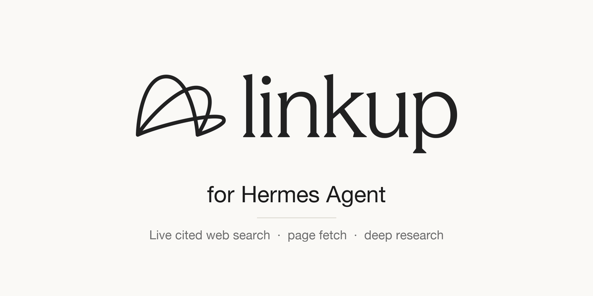

# Linkup for Hermes Agent



Real-time, cited web search for [Hermes Agent](https://github.com/NousResearch/hermes-agent), powered by [Linkup](https://www.linkup.so).

- **`linkup_search`**: live web search at four depths (`flash`, `fast`, `standard`, `deep`). It returns ranked sources, a sourced answer, or JSON that matches your schema. Filters: domains and dates.
- **`linkup_fetch`**: turns any URL (HTML or PDF) into clean Markdown. JavaScript rendering is on. An optional `pro` anti-bot mode and schema-based field extraction are available.
- **`linkup_research`** and **`linkup_research_status`**: asynchronous deep research. An agent investigates for minutes and returns a cross-checked, cited report.
- **Web backend**: routes Hermes' built-in `web_search` / `web_extract` tools through Linkup.
- **`/linkup`** slash command and **`hermes linkup`** CLI: status, credit balance, quick search, and backend setup.
- **Bundled skills**: `linkup:web-search` and `linkup:deep-research` teach the agent how to query Linkup well.

Responses are never truncated: every result, source, field, and fetched page comes back exactly as Linkup returns it. Pages over 20k characters are also saved as Markdown under `~/.hermes/cache/linkup/` (`markdown_file` in the result), so the agent can page through them with `read_file` even when Hermes moves an oversized result out of the context.

No extra Python dependencies. The plugin uses only the standard library.

## Install

```bash
hermes plugins install linkup --enable
```

Before the catalog listing is live, install from the repository instead: `hermes plugins install LinkupPlatform/linkup-hermes-plugin --enable`.

You'll be prompted for `LINKUP_API_KEY`. Get a key at [app.linkup.so](https://app.linkup.so). To set or change it later:

```bash
hermes config set LINKUP_API_KEY <your-key>
hermes linkup status        # key, credit balance, current web backend
```

Start a new Hermes session and the `linkup_*` tools are available.

### Use Linkup for Hermes' built-in web tools (optional)

```bash
hermes linkup use-as-web-backend                 # web_search + web_extract
hermes linkup use-as-web-backend --search-only   # only web_search
```

This sets `web.backend: linkup`. If `web.search_backend` or `web.extract_backend` already names another provider, those override `web.backend`, so the command switches them to `linkup` too and prints every key it changed. You can also pick **Linkup** in `hermes tools`.

## Tools

| Tool | Use it for |
|---|---|
| `linkup_search` | Anything current or verifiable: news, prices, people, companies, docs |
| `linkup_fetch` | Reading a URL you already have |
| `linkup_research` | Exhaustive reports and multi-entity comparisons (takes minutes) |
| `linkup_research_status` | Waiting for and collecting a research result |

**Search depth**

| depth | Latency | Best for |
|---|---|---|
| `flash` | fastest | keyword lookups where latency matters most |
| `fast` | ~1s | one keyword-shaped fact |
| `standard` | ~1–3s | most questions (default) |
| `deep` | ~30–120s | find-then-scrape, comparisons, multi-source checks |

**Output types**

- `searchResults` (default): sources with content.
- `sourcedAnswer`: a written answer with citations.
- `structured`: JSON that matches `structured_output_schema`.

## Settings

Settings live under `plugins.entries.linkup.settings` in `~/.hermes/config.yaml`. In Hermes Desktop, open **Capabilities → Plugins → Linkup → ⚙**.

| Key | Default | Meaning |
|---|---|---|
| `search_depth` | `standard` | Default depth for `linkup_search` |
| `web_search_depth` | `standard` | Depth used by the built-in `web_search` when Linkup is the backend |
| `fetch_render_js` | `true` | Render JavaScript when fetching pages |
| `research_reasoning_depth` | `M` | Default `reasoning_depth` for `linkup_research` |

An invalid value falls back to the default and logs a warning.

Example:

```bash
hermes config set plugins.entries.linkup.settings.search_depth fast
```

**Environment variables**

| Variable | Meaning |
|---|---|
| `LINKUP_API_KEY` | Your Linkup API key (required) |
| `LINKUP_API_BASE_URL` | Override the API endpoint (default `https://api.linkup.so/v1`), for proxies or private deployments. Your API key is sent to this host as a bearer token, so only point it at hosts you trust. |

**URL safety**

`linkup_fetch` refuses URLs that look like they contain an API key or token, and it honors Hermes' `website_blocklist`, the same checks core `web_extract` applies.

## Commands

```text
/linkup                     status: key, balance, web backend
/linkup balance             remaining credits
/linkup search <query>      quick cited answer

hermes linkup status
hermes linkup search "latest EU AI Act enforcement news" [--depth deep] [--json]
hermes linkup use-as-web-backend [--search-only | --extract-only]
```

## Development

```bash
git clone https://github.com/LinkupPlatform/linkup-hermes-plugin
ln -snf "$PWD/linkup-hermes-plugin" ~/.hermes/plugins/linkup
hermes plugins enable linkup

python3 -m unittest discover -s tests          # offline unit tests
LINKUP_API_KEY=... python3 tests/live_smoke.py # live API check (add --research for a research run)
hermes plugins validate .                       # catalog admission checks
hermes plugins doctor . --ci                    # real runtime load
```

`catalog/linkup.yaml` is the draft entry for the [Hermes plugin catalog](https://hermes-agent.nousresearch.com/docs/plugins). To publish:

1. Push a tagged release.
2. Set `sha` in the entry to the tag's 40-character commit.
3. Open a PR adding the entry as `plugin-catalog/linkup.yaml` in `NousResearch/hermes-agent`.

## License

MIT. See [LICENSE](LICENSE).
